<!-- PROJECT HEADER -->

<br/>

<h1 align="center">LatencyLens</h1>

<p align="center">
  A production-engineering focused URL shortener platform built for the <b>MLH Production Engineering Hackathon 2026</b>, designed to prove that reliability, observability, and scalability are product features — not afterthoughts.
</p>

<p align="center">
  From <b>fast redirects</b> to <b>graceful failure</b>, <b>alerting</b>, <b>dashboards</b>, and <b>load-tested scaling</b>, this project showcases what “production-ready” actually looks like.
</p>


<p align="center">
  <a href="#-about-the-project">About</a>
  ·
  <a href="#-architecture">Architecture</a>
  ·
  <a href="#-key-features">Features</a>
  ·
  <a href="#-performance-results">Results</a>
  ·
  <a href="#-quick-start">Quick Start</a>
  ·
  <a href="#-documentation">Docs</a>
</p>

<p align="center">
  
  
  
  
  
  
  
  
</p>

---

## Table of Contents

- [About The Project](#-about-the-project)
- [Why This Project Stands Out](#-why-this-project-stands-out)
- [Architecture](#-architecture)
- [Tech Stack](#-tech-stack)
- [Key Features](#-key-features)
- [Production Engineering Highlights](#-production-engineering-highlights)
- [Observability & Incident Response](#-observability--incident-response)
- [Performance Results](#-performance-results)
- [Screenshots](#-screenshots)
- [Project Structure](#-project-structure)
- [Quick Start](#-quick-start)
- [Environment Variables](#-environment-variables)
- [API Overview](#-api-overview)
- [Documentation](#-documentation)
- [Demo Scenarios](#-demo-scenarios)
- [Future Improvements](#-future-improvements)

---

## 📌 About The Project

<p align="center">
  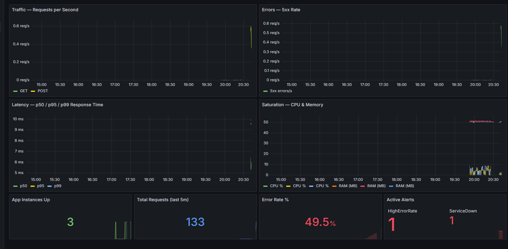
</p>

**LatencyLens** is a production-grade URL shortener built to demonstrate the core skills of a production engineer:

- building reliable services
- finding bottlenecks with real data
- scaling horizontally
- instrumenting systems with metrics and alerts
- designing graceful failure paths
- documenting operations like a real team would

Instead of stopping at “the app works,” this project answers the harder question:

> **What happens when traffic spikes, a service goes down, or something breaks at 2 AM?**

This repo shows the answer with:

- a load-balanced Flask application
- PostgreSQL + PgBouncer for efficient database usage
- Redis caching for faster hot-path reads
- Prometheus metrics + alert rules
- Grafana dashboards for the golden signals
- Dockerized local production environment
- CI, tests, troubleshooting docs, runbooks, and failure-mode analysis

---

## ✨ Why This Project Stands Out

Unlike a basic CRUD demo, this project is built like a small real-world service:

- **Reliability-first**: health checks, restart policies, graceful errors, fault tolerance
- **Scalability-focused**: 3 app replicas, Nginx load balancing, caching, connection pooling
- **Observable**: metrics, dashboards, logs, alerts, incident workflow
- **Performance-validated**: Locust load tests at 50, 200, 500, and up to 5,000 concurrent users
- **Operations-ready**: runbooks, deploy guide, troubleshooting guide, decision log, capacity plan

---

## 🏗 Architecture

```text
                        ┌──────────────────────────────┐
Internet ──▶ Nginx :80  │  least_conn load balancer    │
                        └───┬───────────┬──────────┬───┘
                            │           │          │
                       app1:5000   app2:5000   app3:5000
                       (Flask)     (Flask)     (Flask)
                            │           │          │
                        ┌───▼───────────▼──────────▼───┐
                        │   PgBouncer connection pool   │
                        └───────────────┬───────────────┘
                                        │
                                  PostgreSQL :5432

                        ┌──────────────────────────────┐
                        │ Redis :6379 (hot-path cache) │
                        └──────────────────────────────┘

                        ┌──────────────────────────────┐
                        │ Prometheus + Alertmanager    │
                        │ Grafana dashboards           │
                        └──────────────────────────────┘
```

### Request flow

1. Client sends request to **Nginx**
2. Nginx balances traffic across **3 Flask app instances**
3. Hot redirect paths are served faster with **Redis caching**
4. Database connections are pooled through **PgBouncer**
5. Metrics are scraped by **Prometheus**
6. Dashboards are visualized in **Grafana**
7. Critical issues trigger **alerts** for incident response

---

## 🧰 Tech Stack

### Backend
- Python
- Flask
- Peewee ORM
- Gunicorn

### Data Layer
- PostgreSQL
- PgBouncer
- Redis

### Infrastructure
- Docker Compose
- Nginx

### Observability
- Prometheus
- Alertmanager
- Grafana
- Structured JSON logs

### Testing & Validation
- Pytest
- pytest-cov
- Locust
- GitHub Actions CI

---

## 🚀 Key Features

### Smart URL Shortening
Create short URLs, resolve them quickly, list them, deactivate them, and inspect click stats.

### Fast Redirect Path
Frequently accessed short codes are cached in Redis so redirects avoid repeated database reads.

### Horizontal Scaling
Three app replicas sit behind Nginx, allowing the system to keep serving traffic even when one instance goes down.

### Graceful Failure
Bad input returns clean JSON errors. Infrastructure failures degrade gracefully where possible instead of crashing the whole service.

### Operational Visibility
The project exposes `/metrics`, ships structured logs, and provides dashboards for traffic, latency, errors, and saturation.

### Real Documentation
This repo includes a deploy guide, troubleshooting guide, runbook, decision log, bottleneck report, capacity plan, and verification notes.

---

## 🛡 Production Engineering Highlights

### Reliability
- `/health` liveness endpoint
- restart policies for automatic container recovery
- resilient routing through multiple app instances
- JSON-only error responses instead of stack traces

### Scalability
- 3 Flask replicas behind Nginx
- connection pooling with PgBouncer
- Redis caching on redirect path
- Nginx health caching
- reduced Gunicorn worker count to avoid memory pressure

### Performance Optimization
- async click tracking moved off the redirect hot path
- optimized insert strategy for short URL creation
- pooled database connections to reduce connection overhead

### Operability
- runbook for incidents
- troubleshooting guide for common failures
- alerting for service down and high error rate
- dashboard-based root cause analysis workflow

---

## 📈 Observability & Incident Response

<p align="center">
  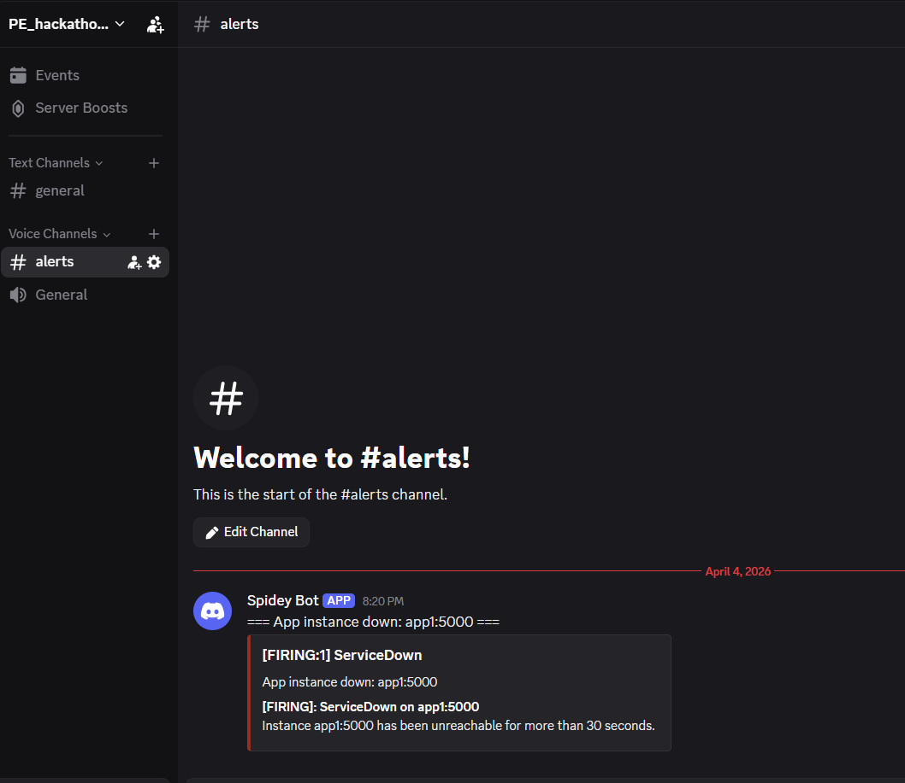
  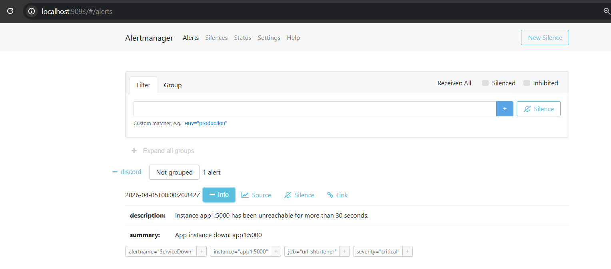
</p>

This project tracks the **four golden signals** in Grafana:

- **Latency** — p50 / p95 / p99 response times
- **Traffic** — requests per second and method distribution
- **Errors** — 4xx / 5xx trends and alerting thresholds
- **Saturation** — CPU, RAM, instance health, and active alerts

### Alerting flow
- Prometheus evaluates alert rules
- Alertmanager routes incidents
- Discord receives notifications
- Runbook guides recovery steps

### Example incident handled
A spike in error rate fired alerts, but dashboards showed low p99 latency and all three instances still up. That pointed to a startup race condition around database readiness rather than an app logic failure — exactly the kind of diagnosis production engineering is about.

---

## 🏁 Performance Results

### Bronze Tier — 50 concurrent users
| Metric | Before | After |
|--------|--------|-------|
| Requests/sec | 52.2 | **123.6** |
| p50 latency | 91 ms | **31 ms** |
| p95 latency | 950 ms | **380 ms** |
| p99 latency | 2,400 ms | **840 ms** |
| Error rate | ~0% | ~0% |

### Silver Tier — 200 concurrent users
| Metric | Before | After |
|--------|--------|-------|
| Requests/sec | 57.7 | **218.2** |
| p50 latency | 1,100 ms | **510 ms** |
| p95 latency | 5,200 ms | **1,300 ms** |
| p99 latency | 8,600 ms | **2,000 ms** |
| Error rate | ~0% | **1%** |

### Gold Tier — 500 concurrent users
| Metric | Before | After |
|--------|--------|-------|
| Requests/sec | 114.5 | **238.66** |
| p50 latency | 3,500 ms | **1,700 ms** |
| p95 latency | 14,000 ms | **3,700 ms** |
| p99 latency | 27,000 ms | **5,500 ms** |
| Error rate | ~0% | **1%** |

### 🏆 Beyond Gold — Stretch Tests
| Users | RPS | Error Rate |
|-------|-----|------------|
| 1,000 | **139.11** | **~0%** |
| 2,000 | **138.58** | **3%** |
| 5,000 | **146.41** | **5%** |

> The system scales to **10× the Gold target** while staying at or below the 5% error threshold.

### Biggest wins
- **+108% higher throughput** at 500 users (114.5 → 238.66 RPS)
- **-80% lower p99 latency** at 500 users (27s → 5.5s)
- **75% memory reduction** from worker tuning
- **10× Gold target** handled (5,000 users, 5% error rate)

---

## 🖼 Screenshots

### Dashboard & Observability
<p align="center">
  
</p>

### Health Checks & CI
<p align="center">
  
  
</p>

### Load Testing Improvements
<p align="center">
  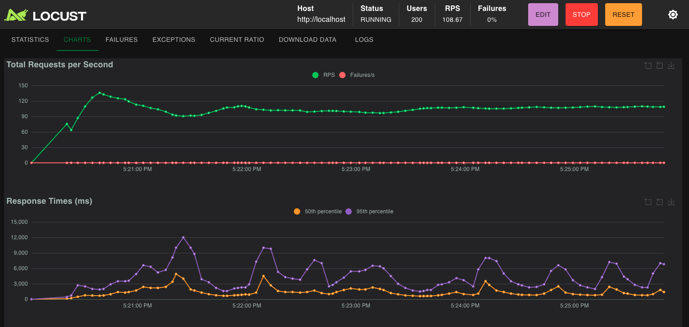
  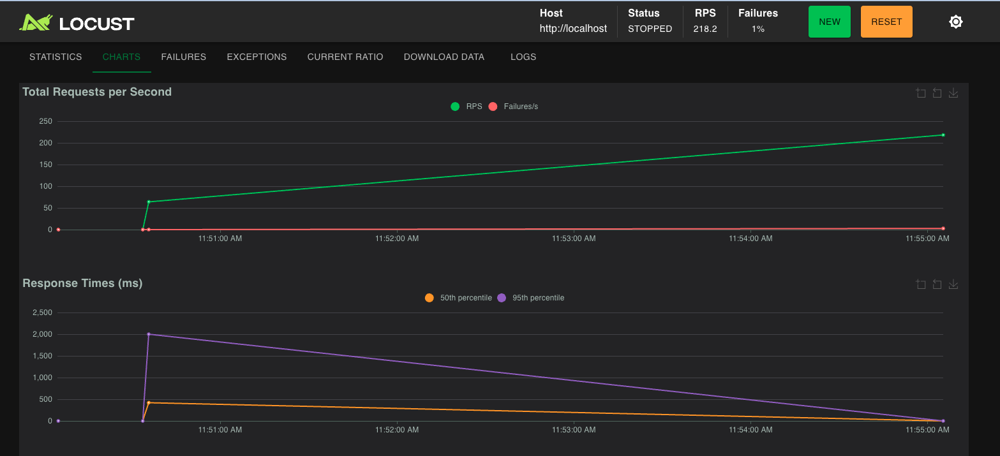
</p>

<p align="center">
  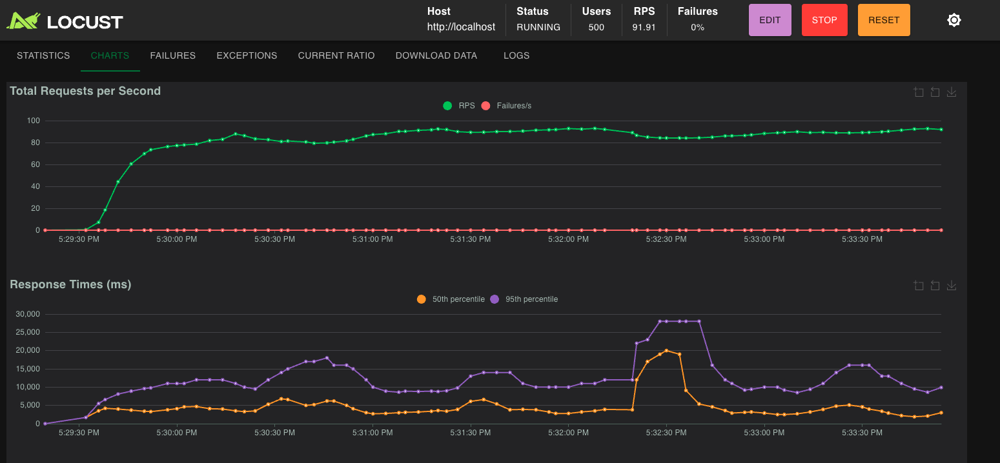
  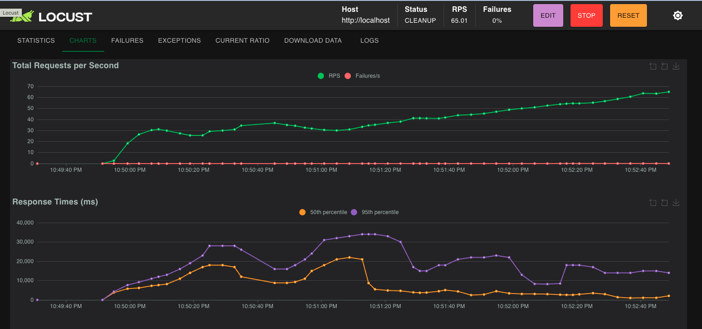
</p>

### Stretch Tests (Beyond Gold)
<p align="center">
  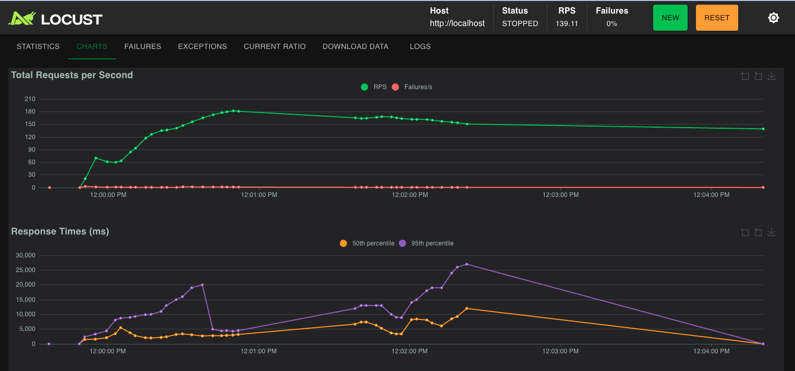
  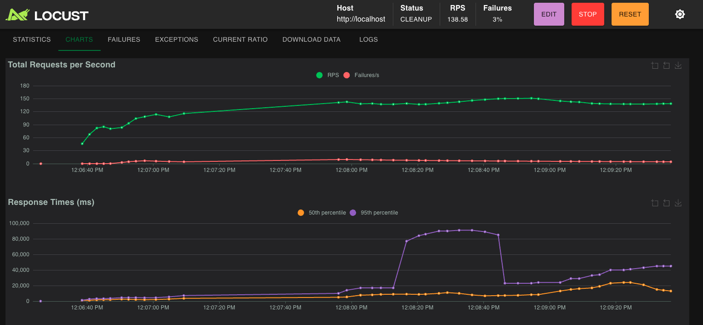
  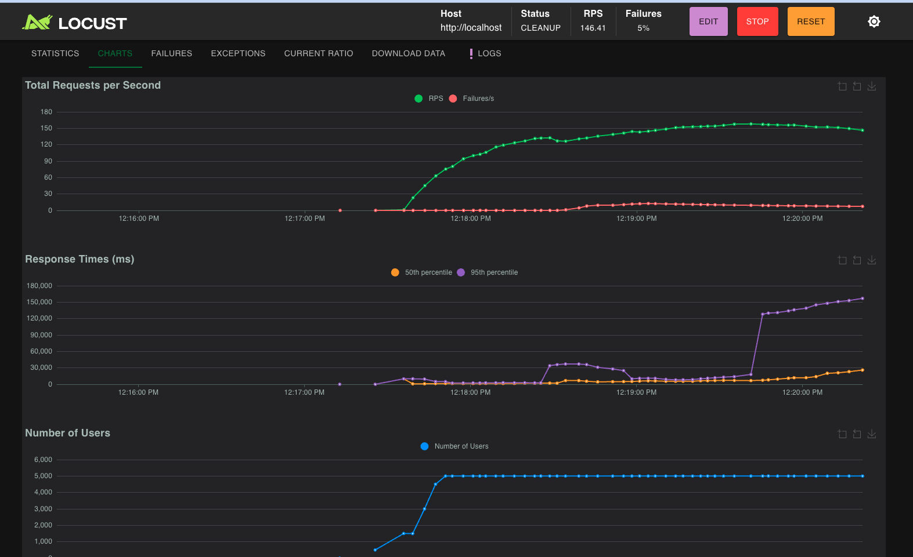
</p>

### Graceful Failure
<p align="center">
  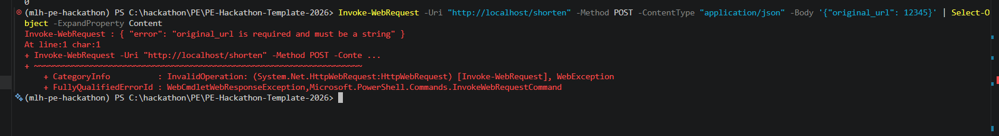
</p>

---

## 🗂 Project Structure

```text
PE-Hackathon-Template-2026/
├── app/
│   ├── __init__.py
│   ├── cache.py
│   ├── database.py
│   ├── models/
│   │   ├── event.py
│   │   ├── url.py
│   │   └── user.py
│   └── routes/
│       ├── events.py
│       ├── urls.py
│       └── users.py
├── docs/
│   ├── api.md
│   ├── bottleneck-report.md
│   ├── capacity-plan.md
│   ├── config.md
│   ├── decision-log.md
│   ├── deploy-guide.md
│   ├── failure-modes.md
│   ├── runbook.md
│   ├── scalability.md
│   ├── troubleshooting.md
│   ├── verification.md
│   └── screenshots/
├── grafana/
├── prometheus/
├── alertmanager/
├── nginx/
├── docker-compose.yml
├── locustfile.py
├── pyproject.toml
├── run.py
└── README.md
```

---

## ⚡ Quick Start

### Prerequisites
- Docker Desktop
- Python + `uv` (for local dev)
- PostgreSQL if running without Docker

### Run with Docker

```bash
git clone <repo-url>
cd PE-Hackathon-Template-2026
cp .env.example .env

docker compose up --build -d
docker compose exec app1 uv run load_data.py
curl http://localhost/health
```

### Local Development

```bash
uv sync --extra dev
createdb hackathon_db
cp .env.example .env
uv run run.py
uv run load_data.py
curl http://localhost:5000/health
```

---

## 🔐 Environment Variables

Example setup:

```env
DATABASE_NAME=hackathon_db
DATABASE_USER=postgres
DATABASE_PASSWORD=postgres
DATABASE_HOST=localhost
DATABASE_PORT=5432
REDIS_URL=redis://localhost:6379/0
BASE_URL=http://localhost
```

For the full configuration reference, see [`docs/config.md`](./docs/config.md).

---

## 🔌 API Overview

| Method | Endpoint | Purpose |
|--------|----------|---------|
| GET | `/health` | Service health check |
| POST | `/shorten` | Create a shortened URL |
| GET | `/<code>` | Redirect to original URL |
| GET | `/urls` | List URLs with pagination |
| GET | `/urls/<id>` | Fetch one URL |
| DELETE | `/urls/<id>` | Deactivate a URL |
| GET | `/stats/<code>` | View click stats |

Full request/response examples live in [`docs/api.md`](./docs/api.md).

---

## 📚 Documentation

| Document | What it Covers |
|----------|----------------|
| [`docs/api.md`](./docs/api.md) | Full API reference |
| [`docs/deploy-guide.md`](./docs/deploy-guide.md) | Deployment, rollout, rollback |
| [`docs/config.md`](./docs/config.md) | Environment variable details |
| [`docs/troubleshooting.md`](./docs/troubleshooting.md) | Common issues and fixes |
| [`docs/runbook.md`](./docs/runbook.md) | Incident response playbook |
| [`docs/failure-modes.md`](./docs/failure-modes.md) | Failure scenarios and recovery |
| [`docs/decision-log.md`](./docs/decision-log.md) | Architecture decisions |
| [`docs/capacity-plan.md`](./docs/capacity-plan.md) | Scaling assumptions and limits |
| [`docs/bottleneck-report.md`](./docs/bottleneck-report.md) | Performance diagnosis and fixes |
| [`docs/scalability.md`](./docs/scalability.md) | Bronze / Silver / Gold scaling journey |
| [`docs/verification.md`](./docs/verification.md) | Reliability and observability proof |

---

## 🎬 Demo Scenarios

### 1. Reliability Demo
```bash
docker compose kill app1
curl http://localhost/health
```
Expected result: service stays up because Nginx routes to healthy instances.

### 2. Graceful Failure Demo
```bash
curl -s -X POST http://localhost/shorten \
  -H "Content-Type: application/json" \
  -d '{"original_url": 12345}'
```
Expected result: clean JSON validation error, no stack trace.

### 3. Load Test Demo
```bash
uv run locust -f locustfile.py --host http://localhost \
  --headless -u 500 -r 50 --run-time 2m
```
Expected result: strong throughput with monitored latency and low error rate.

---

## 🔮 Future Improvements

- Background job queue for event ingestion
- Rate limiting and abuse protection
- Authenticated admin dashboard
- Multi-region caching strategy
- PostgreSQL read replicas for heavier read traffic
- Redis Sentinel / Cluster for higher availability
- OpenTelemetry tracing for distributed diagnostics

---

## 👩‍💻 Author / Team Notes

Built for the **MLH Production Engineering Hackathon 2026**.

- Juhi Bhandari
- Esosa Ohangbon
- Pavan Deepak Malla