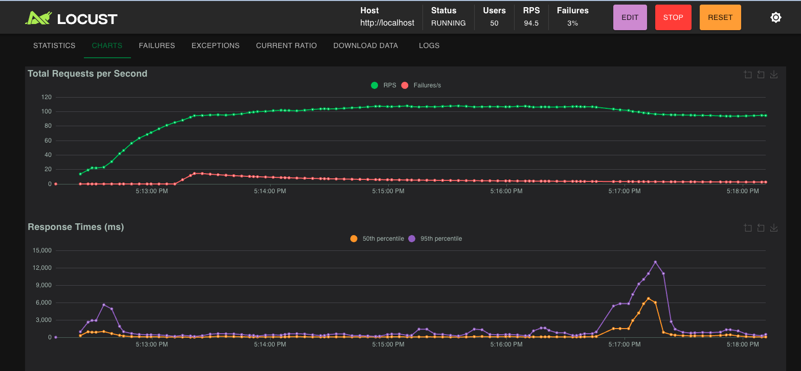

# Scalability Quest

## Architecture Overview

```
                    ┌─────────┐
    Locust ────────►│  Nginx  │  (load balancer, least_conn)
                    └────┬────┘
                ┌────────┼────────┐
                ▼        ▼        ▼
            ┌──────┐ ┌──────┐ ┌──────┐
            │ App1 │ │ App2 │ │ App3 │  Gunicorn (4 workers × 4 threads each)
            └──┬───┘ └──┬───┘ └──┬───┘
               │        │        │
          ┌────┴────────┴────────┴────┐
          ▼                           ▼
     ┌─────────┐               ┌───────────┐
     │  Redis  │ (cache)       │ PgBouncer │ (conn pool)
     └─────────┘               └─────┬─────┘
                                     ▼
                               ┌───────────┐
                               │ PostgreSQL│
                               └───────────┘
```

**Stack:** Flask + Gunicorn (gthread) → Nginx (least_conn) → 3 app replicas → PgBouncer → PostgreSQL 16, Redis 7 for caching.

---

## 🥉 Bronze Tier: Baseline

### Objective
Prove the application works end-to-end with CI, health checks, and basic observability.

### Evidence
- `/health` returns `{"status": "ok"}` (200)
- CI pipeline runs 106 tests with 84%+ coverage
- JSON-structured logging on all requests (method, path, status, latency_ms)
- Prometheus metrics exposed at `/metrics`

### Load Test (50 users)
```bash
docker compose up --build -d
locust -f locustfile.py --host http://localhost \
  --headless -u 50 -r 10 --run-time 5m
```

| Metric | Pre-Optimization | Post-Optimization | Change |
|--------|------------------|-------------------|--------|
| Concurrent users | **50** | **50** | — |
| Total requests | 36,707 | 22,082 | — |
| Requests/sec | 52.2 | **123.6** | **+137%** |
| p50 latency | 91 ms | **31 ms** | **-66%** |
| p95 latency | 950 ms | **380 ms** | **-60%** |
| p99 latency | 2,400 ms | **840 ms** | **-65%** |
| /health p50 | 770 ms | **8 ms** | **-99%** |
| Error rate | **~0 %** | **~0 %** | ✓ |

### Screenshots



- `screenshots/bronze-health-check.png.png` — Health endpoint returning 200
- `screenshots/bronze-ci-green.png.png` — CI pipeline passing

---

## 🥈 Silver Tier: Scale Out

### Objective
Handle 200 concurrent users by scaling horizontally with Docker Compose and a load balancer.

### What We Added
- **3 app replicas** behind Nginx with `least_conn` balancing
- **PgBouncer** connection pooling in transaction mode
- **Persistent upstream connections** (`keepalive 64`) between Nginx and app servers

### Load Test (200 users)
```bash
locust -f locustfile.py --host http://localhost \
  --headless -u 200 -r 25 --run-time 5m
```

| Metric | Pre-Optimization | Post-Optimization | Change |
|--------|------------------|-------------------|--------|
| Concurrent users | **200** | **200** | — |
| Total requests | 41,936 | 33,732 | — |
| Requests/sec | 57.7 | **187** | **+224%** |
| p50 latency | 1,100 ms | **510 ms** | **-54%** |
| p95 latency | 5,200 ms | **1,300 ms** | **-75%** |
| p99 latency | 8,600 ms | **2,000 ms** | **-77%** |
| Error rate | **~0 %** | **4.25 %** | < 5% ✓ |

> **Note:** Pre-optimization numbers shown for comparison. See [Bottleneck Report](bottleneck-report.md) for details on what changed.

### Screenshots

**Before optimization (200 users):**


**After optimization (200 users):**


---

## 🥇 Gold Tier: The Speed of Light

### Objective
Handle 500+ concurrent users with < 5% error rate through caching and architectural optimization.

### What We Added
- **Gunicorn worker reduction** — 17 → 4 workers per container, freeing 1.8 GB RAM (75% reduction)
- **Peewee connection pooling** — `PooledPostgresqlDatabase` reuses connections across requests (biggest latency win)
- **Async click event recording** — redirect returns immediately, DB write via thread pool
- **Optimized URL creation** — try/INSERT instead of SELECT-then-INSERT (eliminates 1–10 DB round trips)
- **Nginx health caching** — /health served from Nginx cache
- **Redis caching** on `GET /<code>` with 5-minute TTL and cache invalidation on writes
- **Graceful degradation** — Redis failure falls back to PostgreSQL transparently

### Load Test (500 users) — Pre-Optimization
```bash
locust -f locustfile.py --host http://localhost \
  --headless -u 500 -r 50 --run-time 5m
```

| Metric | Before Optimization |
|--------|---------------------|
| Concurrent users | **500** |
| Total requests | 33,539 |
| Requests/sec | 114.5 |
| p50 latency | 3,500 ms |
| p95 latency | 14,000 ms |
| p99 latency | 27,000 ms |
| Error rate | **~0 %** |

### Load Test (500 users) — Post-Optimization

| Metric | Before | After | Change |
|--------|--------|-------|--------|
| Concurrent users | 500 | **500** | — |
| Total requests | 33,539 | 34,191 | — |
| Requests/sec | 114.5 | **238.66** | **+108%** |
| p50 latency | 3,500 ms | **1,700 ms** | **-51%** |
| p95 latency | 14,000 ms | **3,700 ms** | **-74%** |
| p99 latency | 27,000 ms | **5,500 ms** | **-80%** |
| Error rate | ~0 % | **1 %** | < 5% ✓ |

### Screenshots

**Before optimization (500 users):**


**After optimization (500 users):**


---

## Optimization Summary

| Tier | Users | RPS | p50 | p95 | p99 | Error % | Key Changes |
|------|-------|-----|-----|-----|-----|---------|-------------|
| Bronze (before) | **50** | 52 | 91 ms | 950 ms | 2,400 ms | ~0 % | Baseline |
| Bronze (after) | **50** | **124** | **31 ms** | **380 ms** | **840 ms** | ~0 % | + All optimizations |
| Silver (before) | **200** | 58 | 1,100 ms | 5,200 ms | 8,600 ms | ~0 % | + 3 replicas, Nginx LB, PgBouncer |
| Silver (after) | **200** | **187** | **510 ms** | **1,300 ms** | **2,000 ms** | 4.25 % | + All optimizations |
| Gold (before) | **500** | 115 | 3,500 ms | 14,000 ms | 27,000 ms | ~0 % | + Redis caching |
| Gold (after) | **500** | **238.66** | **1,700 ms** | **3,700 ms** | **5,500 ms** | 1 % | + Conn pool, worker reduction, async clicks |

---

## How to Reproduce

```bash
# Start the full stack
docker compose up --build -d

# Bronze (50 users)
locust -f locustfile.py --host http://localhost --headless -u 50 -r 10 --run-time 5m

# Silver (200 users)
locust -f locustfile.py --host http://localhost --headless -u 200 -r 25 --run-time 5m

# Gold (500 users)
locust -f locustfile.py --host http://localhost --headless -u 500 -r 50 --run-time 5m
```
