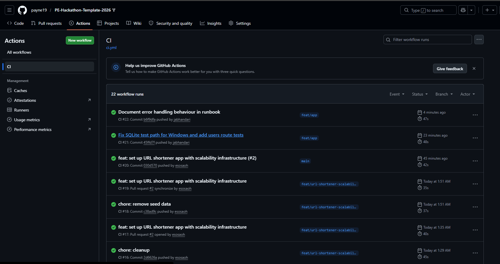
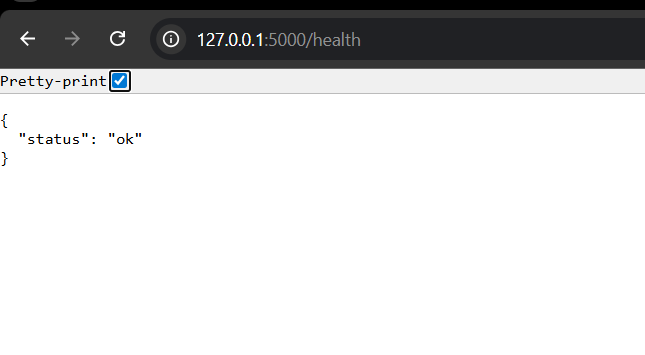
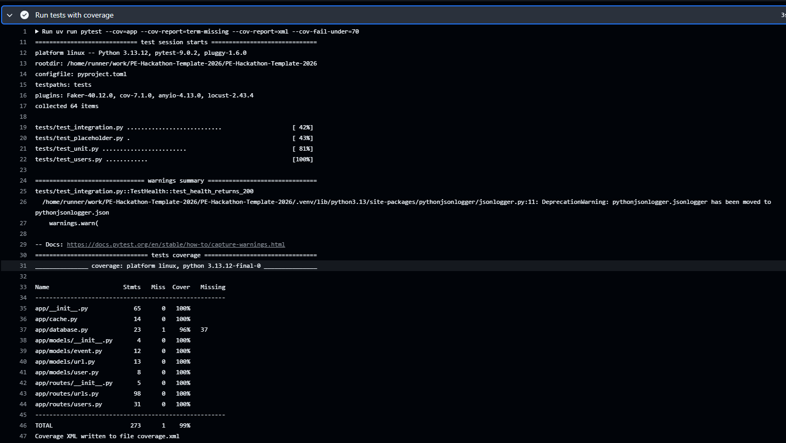
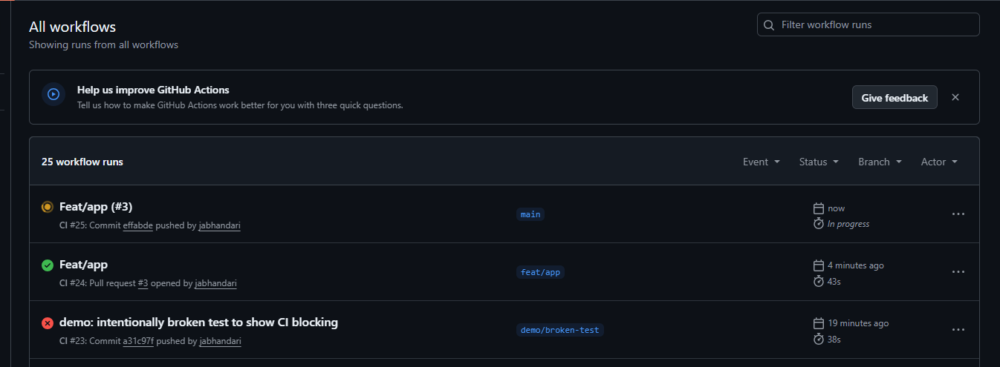

# Reliability Engineering — Quest Verification

## Bronze Tier: The Shield

### Unit Tests + CI (GitHub Actions)
CI runs on every push and pull request. All 64 tests pass.

### Health Check Endpoint
`GET /health` returns `{"status": "ok"}` with HTTP 200.

---

## Silver Tier: The Fortress

### Test Coverage Report
`pytest-cov` enforces a minimum of 70% coverage. Current coverage is 99% across 273 statements.

### Blocked Deploy on Failing Tests
CI automatically blocks merges when tests fail. The red check below shows a build blocked due to a failing test — no broken code can reach production.

