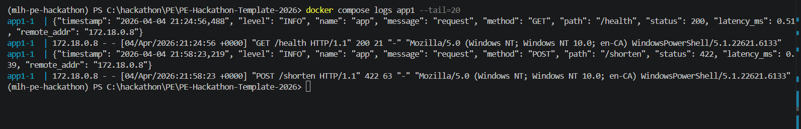
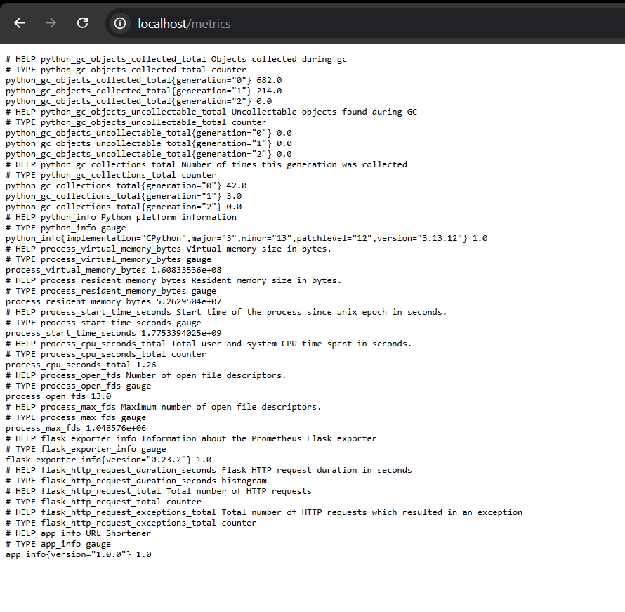

# Reliability Engineering — Quest Verification

## Bronze Tier: The Shield

### Unit Tests + CI (GitHub Actions)
CI runs on every push and pull request. All 64 tests pass.

### Health Check Endpoint
`GET /health` returns `{"status": "ok"}` with HTTP 200.

---

## Silver Tier: The Fortress

### Test Coverage Report
`pytest-cov` enforces a minimum of 70% coverage. Current coverage is 99% across 273 statements.

### Blocked Deploy on Failing Tests
CI automatically blocks merges when tests fail. The red check below shows a build blocked due to a failing test — no broken code can reach production.

---

## Gold Tier: The Immortal

### Graceful Failure — Garbage Data → Polite Error
Sending an integer instead of a URL string to `POST /shorten` returns a clean JSON error, never a Python stack trace.

### Chaos Mode — Container Restart Policy
All app containers (`app1`, `app2`, `app3`) are configured with `restart: always` in `docker-compose.yml`. When any container crashes, Docker automatically restarts it. Nginx routes traffic to the other two instances while the crashed container recovers — users see no downtime.

See [docker-compose.yml](../docker-compose.yml) line 49: `restart: always`

### Failure Mode Documentation
Full failure mode reference covering all known failure scenarios, automatic recovery behaviour, and manual recovery steps:

[docs/failure-modes.md](failure-modes.md)

---

## Incident Response — Bronze Tier: The Watchtower

### Structured JSON Logs
All requests are logged in structured JSON format with `timestamp`, `level`, `method`, `path`, `status`, and `latency_ms`. No print statements.

### /metrics Endpoint
Prometheus metrics exposed at `/metrics` showing CPU usage, RAM, GC stats, Flask request counts, and app info.

---

## Incident Response — Silver Tier: The Alarm

### Alert Configuration
Prometheus alert rules configured for:
- `ServiceDown` — fires within 30s when any app instance is unreachable (severity: critical)
- `HighErrorRate` — fires when exception rate exceeds threshold for 1 minute (severity: warning)

Alert rules: [prometheus/alerts.yml](../prometheus/alerts.yml)
Alertmanager config: [alertmanager/alertmanager.yml](../alertmanager/alertmanager.yml)

### Alertmanager Firing Alert
Alert visible in Alertmanager UI routed to the Discord receiver.

### Discord Notification
Alert delivered to Discord channel within 30 seconds of the service going down.

